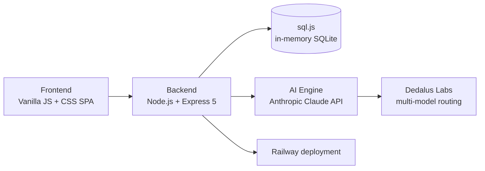

<div align="center">

# VisionFi

### *Intelligent Budget Planner for the Modern Age*

** TartanHacks 2026 — Carnegie Mellon University**

[](https://nodejs.org)
[](https://expressjs.com)
[](https://anthropic.com)
[](https://railway.app)

<br/>

[ **Live Demo**](https://visionfi-prod.up.railway.app/) · [ Features](#-features) · [ Quick Start](#-quick-start) · [ Architecture](#-architecture) · [ Sponsor Tracks](#-sponsor-tracks--challenges-addressed)

<br/>


</div>

---

<br/>

## What is VisionFi?

VisionFi is a full-stack AI-powered financial planner that brings together **budgeting, credit management, investment tracking, and personalized insights** into one beautiful dashboard. Built with a Visa-inspired design language, it empowers users to take control of their finances through intelligent automation and goal-oriented AI guidance.

> *Your finances, one vision ahead.*

<br/>

## Features

| | Feature | Description |
|---|---------|-------------|
|  | **Dashboard** | Net worth overview, income/expense tracking, transaction management & budget monitoring |
|  | **Smart Shopping** | AI-powered shopping planner with deal discovery and card-matched offers |
|  | **Subscriptions** | Usage analysis, cancellation recommendations & a guard for unused services |
|  | **Credit & Loans** | Credit score monitoring, card management, loan tracking & spending breakdowns |
|  | **Investments** | Stock, mutual fund & bond portfolio tracking with historical performance charts |
|  | **Insights & Predictions** | AI-generated spending insights and cash-flow forecasting |
|  | **Learn** | Financial literacy hub with gamified courses, quizzes, blogs & daily challenges |
|  | **AI Chat Assistant** | Goal-oriented financial advisor powered by Claude with multi-model orchestration |
|  | **Smart Automations** | Round-up savings, under-budget sweeps, bill reminders, spending alerts & more |

<br/>

---

## Sponsor Tracks & Challenges Addressed

VisionFi was built to address the challenges posed by **three sponsor tracks** at TartanHacks 2026. Below is how each track's problem statement maps to our solution.

<br/>

### Visa — *"Reimagine the Future of Payments & Financial Management"*

> **Challenge:** Build an innovative solution that improves how consumers manage, track, and optimize their financial lives — leveraging modern payment ecosystems.

| Challenge Area | How VisionFi Addresses It |
|:---------------|:--------------------------|
| **Unified Financial Dashboard** | A single-pane-of-glass view across transactions, budgets, credit cards, loans, subscriptions, and investments — all tied to real card data (Visa, Amex, Mastercard, Discover). |
| **Smart Budget Tracking** | Real-time budget monitoring with AI-categorized transactions, daily/weekly/monthly savings targets, and visual spending breakdowns by category. |
| **Credit Score & Card Management** | Full credit report with score rating, utilization tracking, hard inquiries, and per-card spending analysis — emulating Visa's vision for cardholder empowerment. |
| **AI-Powered Predictions** | ML-based cash-flow forecasting that predicts daily, weekly, and monthly spending patterns so users can stay ahead of bills and avoid overdrafts. |
| **Subscription Intelligence** | A subscription guard that detects unused services, estimates annual waste, and recommends cancellations — protecting consumers from "subscription creep." |
| **Smart Automations** | Automated savings rules (round-ups, under-budget sweeps, daily auto-save) that turn passive card usage into active wealth-building. |

<br/>

### Capital One — *"Empower Consumers with Smarter Financial Tools"*

> **Challenge:** Create tools that help consumers make better spending decisions, improve financial literacy, and unlock the most value from their financial products.

| Challenge Area | How VisionFi Addresses It |
|:---------------|:--------------------------|
| **Smart Shopping Planner** | A personalized offer engine that matches merchant deals to the user's spending history and card portfolio — inspired by Capital One Shopping. Users see offers from Whole Foods, Amazon, Target, Uber, and more with auto-activated cashback. |
| **Budget-Aware Recommendations** | Shopping recommendations are filtered through the user's real-time budget status — only surfacing deals in categories where they have remaining budget flexibility (< 70% spent). |
| **Personalized Offer Matching** | The system analyzes the last 100 transactions to identify top merchants and spending categories, then ranks offers by relevance — so each user sees deals tailored to their actual habits. |
| **Financial Literacy Hub** | A gamified **Learn** module with structured courses (Budgeting 101, Investing Basics, Credit Mastery), interactive quizzes, curated blog articles, daily challenges, an XP/leveling system, and achievement badges — making financial education engaging and sticky. |
| **Debt Payoff Intelligence** | Loan tracking with EMI schedules, interest rate comparisons, and remaining balance projections — helping users optimize their payoff strategy across student loans, auto loans, personal loans, and mortgages. |

<br/>

### Dedalus Labs — *"Best Use of the Dedalus SDK"*

> **Challenge:** Demonstrate creative, impactful use of the Dedalus Labs SDK for multi-model AI orchestration — showing how routing across different LLMs can produce results no single model achieves alone.

| Challenge Area | How VisionFi Addresses It |
|:---------------|:--------------------------|
| **Multi-Model Orchestration Pipeline** | The **Smart Spending Orchestrator** is VisionFi's killer feature. It chains three different AI models in sequence through the Dedalus SDK, with each model handling the task it's best suited for: |
| | **Step 1 → Claude Haiku** *(speed)* — Rapid transaction categorization and spending breakdown across all user accounts. |
| | **Step 2 → GPT-4o-mini** *(cost-effective analysis)* — Pattern detection across spending, subscriptions, and credit utilization to surface hidden trends. |
| | **Step 3 → Claude Sonnet** *(reasoning quality)* — Synthesizes outputs from Steps 1 & 2 to generate actionable, personalized financial advice with a savings roadmap. |
| **Intelligent Fallback** | If the Dedalus SDK is unavailable, the system gracefully degrades to direct Anthropic API calls (Claude Sonnet for all steps) — ensuring zero downtime. |
| **Model Handoff Visibility** | The UI shows users the live orchestration pipeline — which model is running, what task it's performing, and timing metrics — making the multi-model approach transparent and educational. |
| **Goal-Oriented AI Chat** | The chat assistant uses Dedalus-routed models for different conversation phases: quick classification for intent detection, deeper reasoning for personalized financial planning, and fast models for follow-up Q&A. |

<br/>

---

## Tech Stack



<br/>

## Quick Start

**1 ·** Clone the repo

```bash
git clone https://github.com/your-username/Financial-Budget-Planner.git
cd Financial-Budget-Planner
```

**2 ·** Install dependencies

```bash
npm install
```

**3 ·** Set up environment variables

```bash
cp .env.example .env
```

```env
ANTHROPIC_API_KEY=sk-ant-...
DEDALUS_API_KEY=your-key-here   # optional — enables multi-model orchestration
```

**4 ·** Launch

```bash
npm start
```

**5 ·** Open [**localhost:3000**](http://localhost:3000) and explore 

<br/>

### Demo Accounts

| Email | Password |
|:------|:---------|
| `alex@cmu.edu` | `demo123` |
| `sarah@gmail.com` | `demo123` |
| `jay@cmu.edu` | `demo123` |

<br/>

## Architecture

```
VisionFi/
│
├── server.js             # Express API · DB schema · AI endpoints · Dedalus orchestrator
├── index.html            # Entry point
│
├── app.js                # Main frontend — routing, state, dashboard, automations
├── chat.js               # AI chat assistant & goal-based agent
├── credit.js             # Credit score, cards, loans & spending
├── investment.js          # Stock, fund & bond portfolio tracking
├── insight.js            # AI-powered spending insights
├── prediction.js         # Cash-flow prediction engine
├── automation.js         # Smart savings automations
├── learn.js              # Financial literacy hub — courses, quizzes, gamification
├── styles.css            # Global styles
│
├── package.json
└── .env                  # API keys (not committed)
```

<br/>

## Deployment

The app is live on Railway:

> ** [https://visionfi-prod.up.railway.app](https://visionfi-prod.up.railway.app/)**

To deploy your own instance, connect the repo to [Railway](https://railway.app) and add your environment variables (`ANTHROPIC_API_KEY`, optionally `DEDALUS_API_KEY`) in the dashboard.

<br/>

---

<div align="center">

**Built with and at TartanHacks 2026**

*Carnegie Mellon University · Pittsburgh, PA*

</div>
